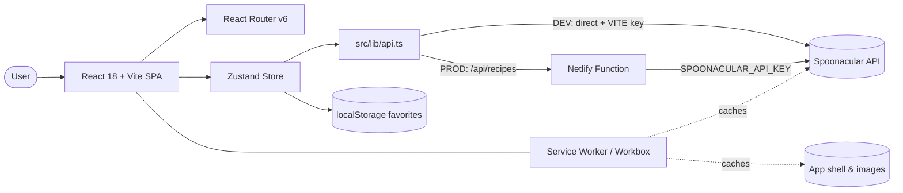

# Recipe Web App — Step-by-Step Build Guide

> **Archived: original build playbook.** This document is the original roadmap used to build Recipe Web App, written as a sequence of self-contained steps from project scaffolding to production deployment. The codebase may have evolved since this guide was written, so treat it as a making-of narrative rather than a live specification. For current setup, architecture, and deployment notes, see [../README.md](../README.md).

---

> **Project Summary:** Recipe Web App is a modern, responsive recipe discovery Progressive Web App. Users can search thousands of recipes, browse curated world cuisines, view full recipe details (ingredients, step-by-step instructions, cooking time, servings, health score, diet labels), and save favorites that remain available offline. Recipe data comes from the Spoonacular API. In production the API key is never shipped to the browser: all requests are proxied through a Netlify serverless function. Client state (recipes, categories, search, pagination, favorites) is centralized in a single Zustand store, favorites persist to `localStorage`, and Workbox runtime caching plus a web manifest deliver installable, offline-capable behavior. The stack favors modern, type-safe, accessible patterns with minimal dependencies.

Each step below is a self-contained prompt. Execute them in order.

Stack: React 18, TypeScript, Vite, Tailwind CSS, Zustand, React Router v6, Radix UI, React Hook Form, Zod, Axios, DOMPurify, Netlify Functions, vite-plugin-pwa (Workbox).

---

## Table of Contents

**PHASE 1 — Project Foundation**

- STEP 1 — Project Scaffolding & Dependency Setup
- STEP 2 — Tooling Configuration (TypeScript, Vite, Tailwind, ESLint)
- STEP 3 — Domain Types & Data Helpers

**PHASE 2 — Data Layer**

- STEP 4 — Shared Cuisine Source of Truth
- STEP 5 — Client API Layer (environment-aware)
- STEP 6 — Netlify Serverless Proxy
- STEP 7 — Global State Store (Zustand)

**PHASE 3 — Client Foundation**

- STEP 8 — Reusable UI Primitives
- STEP 9 — Custom Hooks (debounce, intersection observer)
- STEP 10 — Application Layout & Navigation

**PHASE 4 — Client Pages**

- STEP 11 — Recipe Grid, Card & Skeleton
- STEP 12 — Search Form & Category Filter
- STEP 13 — Home, Recipe Detail & Favorites Pages
- STEP 14 — Routing & App Bootstrap

**PHASE 5 — Polish & Deploy**

- STEP 15 — PWA, Offline Caching & Manifest
- STEP 16 — Security, Accessibility & Performance Pass
- STEP 17 — Netlify Deployment

**Appendices**

- Appendix A — Shared Constants & Environment Variables
- Appendix B — Recurring Patterns
- Appendix C — Pre-flight Checklist
- Appendix D — Common Pitfalls

---

## Global Build Rules (apply to EVERY step)

- Do not run `git` commands. Version control is handled manually by the user; do not commit, push, branch, or tag.
- Do not install unapproved packages. Only add a dependency when the step explicitly requires it, and prefer native methods over new dependencies.
- Do not run long-running processes (dev servers, watchers) unless the user requests them.
- Treat every step as self-contained: state its goal, the files it touches, and a clear acceptance result.
- Write clean, readable, well-named code. Identifiers in English, `camelCase` for functions/variables, descriptive names.
- Use modern syntax: ES6+, React Hooks, functional components, `async/await`.
- Keep code reusable and DRY; centralize shared values instead of duplicating them.
- Treat security, performance, and accessibility (a11y) as first-class requirements in every step.

---

## Architecture at a Glance

Key relationships:

- The SPA renders entirely on the client; there is no application database. Recipe data is sourced from the third-party Spoonacular API.
- `src/lib/api.ts` is the single network boundary. In development it calls Spoonacular directly using a `VITE_`-prefixed key; in production it calls the same-origin `/api/recipes` endpoint.
- The Netlify function (`netlify/functions/recipes.ts`) is the production proxy that holds the secret `SPOONACULAR_API_KEY` and forwards requests, keeping the key off the client.
- The Zustand store is the only state owner. Favorites are mirrored to `localStorage` for offline access.
- A Workbox-generated service worker caches the app shell, API responses, and images for offline and repeat-visit performance.

---

# PHASE 1 — PROJECT FOUNDATION

---

## STEP 1 — Project Scaffolding & Dependency Setup

Goal: create a Vite + React + TypeScript project and install the runtime and tooling dependencies.

Files/folders:

- `package.json`, `package-lock.json`
- `index.html`
- `src/main.tsx`, `src/App.tsx`, `src/index.css`, `src/vite-env.d.ts`
- `public/` (icons, favicon)

Dependencies (runtime): `react`, `react-dom`, `react-router-dom`, `zustand`, `axios`, `react-hook-form`, `@hookform/resolvers`, `zod`, `dompurify`, `lucide-react`, `clsx`, `tailwind-merge`, `class-variance-authority`, `tailwindcss-animate`, `@radix-ui/react-dialog`, `@radix-ui/react-tabs`, `@radix-ui/react-slot`.

Dependencies (dev): `vite`, `@vitejs/plugin-react`, `typescript`, `tailwindcss`, `postcss`, `autoprefixer`, `vite-plugin-pwa`, `workbox-window`, `@netlify/functions`, `netlify-cli`, ESLint and TypeScript ESLint packages, `@types/*`.

Implementation notes:

- Define scripts: `dev` (vite), `build` (`tsc -b && vite build`), `lint` (`eslint .`), `preview`, and `netlify` (`netlify dev`).
- `index.html` sets `lang="en"`, theme color `#f97316`, a description meta, the apple-touch icon, and preconnects/loads the Outfit and Playfair Display fonts.
- `src/main.tsx` mounts `<App />` inside `<BrowserRouter>` and `<React.StrictMode>`, and imports `index.css`.

Acceptance: `npm run dev` serves a blank app shell at `http://localhost:5173` with no console errors.

---

## STEP 2 — Tooling Configuration (TypeScript, Vite, Tailwind, ESLint)

Goal: configure strict TypeScript, the Vite `@` alias, Tailwind theme, and a working lint setup.

Files/folders:

- `tsconfig.json`, `tsconfig.node.json`
- `vite.config.ts`
- `tailwind.config.js`, `postcss.config.js`
- `.eslintrc.cjs`
- `.gitignore`

Implementation notes:

- `tsconfig.json`: `strict`, `noUnusedLocals`, `noUnusedParameters`, `noFallthroughCasesInSwitch`, `jsx: react-jsx`, `moduleResolution: bundler`, and a path alias `@/* -> ./src/*`. Redirect `tsBuildInfoFile` to `./node_modules/.tmp/` so `tsc -b` does not clutter the project root.
- `tsconfig.node.json`: `composite: true` for `vite.config.ts`. Because composite projects cannot disable emit under `tsc -b`, set `outDir` and `tsBuildInfoFile` under `./node_modules/.tmp/` so no `vite.config.js`/`.d.ts`/`.tsbuildinfo` files leak into the root.
- `vite.config.ts`: register `@vitejs/plugin-react` and resolve the `@` alias to `./src` (PWA is added in STEP 15).
- `tailwind.config.js`: enable the design tokens used across the app (`background`, `foreground`, `primary`, `secondary`, `muted`, `accent`, `card`, `border`, `destructive`), the `font-display` family, and keyframe/animation utilities (`fade-in`, stagger helpers).
- `.eslintrc.cjs`: extend `eslint:recommended`, `@typescript-eslint/recommended`, and `react-hooks/recommended`; add the `react-refresh` plugin; ignore `dist`, `dev-dist`, `node_modules`, and the config file itself.
- `.gitignore`: ignore `node_modules`, `dist`, `.env*` (except example), `dev-dist`, `.netlify`, and `*.tsbuildinfo`.

Security/performance: strict TypeScript and lint catch unused code and unsafe patterns early; keeping build artifacts out of the root keeps the repository clean.

Acceptance: `npm run build` succeeds and emits only into `dist/`; `npm run lint` runs with no errors.

---

## STEP 3 — Domain Types & Data Helpers

Goal: model the Spoonacular response shapes and provide pure helpers for the UI.

Files/folders:

- `src/types/recipe.ts`

Implementation notes:

- Export interfaces: `Recipe` (full detail), `RecipePreview` (list view), `ExtendedIngredient`, `Measure`, `AnalyzedInstruction`, `InstructionStep`, `Ingredient`, `Category`, and the API response wrappers `SpoonacularSearchResponse`, `SpoonacularRandomResponse`, `CategoriesResponse`.
- Add `extractIngredients(recipe)` returning normalized ingredient objects (prefer `nameClean`).
- Add `extractInstructions(recipe)` that prefers `analyzedInstructions[0].steps`, and falls back to stripping HTML from raw `instructions` and splitting into sentences.

Acceptance: types compile under strict mode; helpers are pure and import-free of React.

---

# PHASE 2 — DATA LAYER

---

## STEP 4 — Shared Cuisine Source of Truth

Goal: define the cuisine list once and share it between the client and the serverless function (DRY).

Files/folders:

- `src/lib/cuisines.ts`

Implementation notes:

- Export `CUISINES: Category[]` with `id`, `name`, and an Unsplash thumbnail `image` for each cuisine (Italian, Mexican, Chinese, Indian, Japanese, Thai, French, Greek, Spanish, Korean, Vietnamese, American).
- Import the `Category` type using a relative path (`../types/recipe`), not the `@/` alias, so the Netlify function's esbuild bundler can also bundle this module.

Acceptance: both `src/lib/api.ts` and `netlify/functions/recipes.ts` can import `CUISINES` without duplicating the list.

---

## STEP 5 — Client API Layer (environment-aware)

Goal: centralize all network access behind typed functions that work in both development and production.

Files/folders:

- `src/lib/api.ts`

Dependencies: `axios`.

Implementation notes:

- Compute `API_BASE_URL`: in `import.meta.env.DEV`, call `https://api.spoonacular.com` directly with the `VITE_SPOONACULAR_API_KEY`; otherwise call the same-origin `/api/recipes` proxy.
- Provide a `buildUrl(action, params)` helper that constructs the correct URL per environment and per action (`search`, `random`, `detail`, `byCategory`, `categories`).
- Export `RECIPES_PER_PAGE = 12` and a `PaginatedResponse` shape (`recipes`, `totalResults`, `hasMore`).
- Export `searchRecipes(query, offset)`, `getRecipesByCategory(category, offset)`, `getRecipeById(id)`, `getRandomRecipes(count)`, and `getCategories()`. In development `getCategories()` returns the shared `CUISINES`; in production it calls the proxy.
- Use a single axios instance with a 15s timeout; log and rethrow errors so the store can present friendly messages.

Security: never hardcode the production key here; the `VITE_` key is development-only and intentionally client-exposed.

Acceptance: each function returns typed data and computes `hasMore` from `offset + results.length < totalResults`.

---

## STEP 6 — Netlify Serverless Proxy

Goal: hide the Spoonacular key in production and forward requests securely.

Files/folders:

- `netlify/functions/recipes.ts`
- `netlify.toml`

Dependencies: `@netlify/functions` (types only).

Implementation notes:

- Read `process.env.SPOONACULAR_API_KEY`; return `500` if missing.
- Handle CORS preflight (`OPTIONS`) and set permissive CORS + JSON headers on every response.
- Switch on the `action` query parameter. Wrap each `case` body in braces (`{ ... }`) to avoid lexical-declaration leakage and satisfy `no-case-declarations`.
- `search`, `random`, `detail`, and `byCategory` build the upstream Spoonacular URL (with `apiKey`, pagination, and `addRecipeInformation`/`fillIngredients` where relevant) and forward the response, propagating upstream non-OK statuses.
- `categories` returns the shared `CUISINES` directly without an upstream call.
- `netlify.toml`: build command `npm run build`, publish `dist`, functions dir `netlify/functions`, esbuild bundler, a redirect from `/api/*` to `/.netlify/functions/:splat`, and an SPA fallback redirect from `/*` to `/index.html`.

Security: the secret key lives only in Netlify environment variables and never reaches the client bundle.

Acceptance: `netlify dev` serves `/api/recipes?action=categories` and returns the cuisine list; other actions proxy Spoonacular successfully.

---

## STEP 7 — Global State Store (Zustand)

Goal: own all recipe, category, search, pagination, and favorites state in one place.

Files/folders:

- `src/store/recipeStore.ts`

Dependencies: `zustand`.

Implementation notes:

- State: `recipes`, `isLoading`, `error`, pagination (`page`, `hasMore`, `totalResults`, `isLoadingMore`), `categories`, `selectedCategory`, `searchQuery`, `favorites`, `currentRecipe`, `isLoadingDetail`.
- Async actions: `fetchCategories` (auto-selects the first cuisine on load, falls back to random recipes on failure), `fetchRecipesByCategory`, `fetchRecipesBySearch`, `fetchRecipeDetail` (checks favorites first for offline access), `fetchRandomRecipes`, and `fetchMoreRecipes` (infinite scroll, de-duplicates by `id`).
- Favorites: `addToFavorites`, `removeFromFavorites`, `isFavorite`, `loadFavoritesFromStorage`, persisted via `localStorage` under `recipe-app-favorites` with `try/catch` guards.
- Use optional `catch {}` syntax where the error value is unused to keep strict lint clean.

Performance: guard `fetchMoreRecipes` against duplicate in-flight requests (`isLoadingMore`/`hasMore`).

Acceptance: actions update state predictably; favorites survive a page reload.

---

# PHASE 3 — CLIENT FOUNDATION

---

## STEP 8 — Reusable UI Primitives

Goal: provide consistent, accessible building blocks.

Files/folders:

- `src/lib/utils.ts` (the `cn` class-merge helper)
- `src/components/ui/button.tsx`, `input.tsx`, `tabs.tsx`, `drawer.tsx`

Dependencies: `clsx`, `tailwind-merge`, `class-variance-authority`, `@radix-ui/react-dialog`, `@radix-ui/react-tabs`, `@radix-ui/react-slot`.

Implementation notes:

- `cn(...inputs)` merges `clsx` output through `tailwind-merge`.
- `Button` uses `class-variance-authority` variants (`default`, `ghost`, sizes including `icon`) and `@radix-ui/react-slot` for `asChild`.
- `Drawer` wraps `@radix-ui/react-dialog` with a left-side slide-in used by the mobile menu.

Accessibility: all interactive primitives expose focus-visible rings, `aria-label`s, and screen-reader-only text where icons stand alone.

Acceptance: primitives render in isolation and pass keyboard focus checks.

---

## STEP 9 — Custom Hooks (debounce, intersection observer)

Goal: encapsulate reusable behavior for search and infinite scroll.

Files/folders:

- `src/hooks/useDebounce.ts` (exports `useDebounce` and `useDebouncedCallback`)
- `src/hooks/useIntersectionObserver.ts`
- `src/hooks/index.ts` (barrel export)

Implementation notes:

- `useDebounce(value, delay)` delays value propagation with a cleared timeout on change/unmount.
- `useIntersectionObserver({ threshold, rootMargin, freezeOnceVisible })` returns `{ ref, isIntersecting, entry }` and guards against missing `IntersectionObserver` support.

Acceptance: a debounced value updates only after the delay; the observer ref reports intersection state.

---

## STEP 10 — Application Layout & Navigation

Goal: assemble the responsive shell: header/search, desktop sidebar, mobile drawer, and mobile bottom nav.

Files/folders:

- `src/components/layout/Layout.tsx`, `Header.tsx`, `Sidebar.tsx`, `MobileNav.tsx`, `Footer.tsx`

Implementation notes:

- `Layout` provides the background gradient, a sticky `Header`, a fixed desktop `Sidebar` (`lg:` and up), the main content container (`max-w-7xl`), `MobileNav`, and `Footer`.
- `Header` shows the logo, an inline `SearchForm` (desktop), and a `Drawer`-based cuisine menu trigger (mobile); the search also renders below the bar on mobile.
- `MobileNav` is a fixed bottom bar with Home and Favorites `NavLink`s, hidden on desktop.

Accessibility: navigation uses semantic landmarks (`header`, `nav`, `main`, `aside`, `footer`) and labeled controls.

Acceptance: layout adapts cleanly between mobile and desktop breakpoints.

---

# PHASE 4 — CLIENT PAGES

---

## STEP 11 — Recipe Grid, Card & Skeleton

Goal: render recipe collections with loading, empty, and infinite-scroll states.

Files/folders:

- `src/components/recipe/RecipeGrid.tsx`, `RecipeCard.tsx`, `RecipeCardSkeleton.tsx`

Implementation notes:

- `RecipeGrid` shows skeletons while loading, an empty state when there are no results, a responsive grid otherwise, and an infinite-scroll sentinel wired to `useIntersectionObserver` + `fetchMoreRecipes`. It also renders a manual "Load more" fallback and a results count.
- `RecipeCard` is `memo`-ized (re-renders only when `id`/`index` change), links to `/recipe/:id`, lazy-loads its image, shows cuisine and diet badges, and exposes a favorite toggle. When favoriting a preview, it fetches the full recipe first so offline detail works.

Performance: memoization, lazy images, and staggered fade-in animations keep large grids smooth.

Acceptance: scrolling near the bottom loads the next page without duplicates.

---

## STEP 12 — Search Form & Category Filter

Goal: provide validated, debounced search and one-click cuisine filtering.

Files/folders:

- `src/components/recipe/SearchForm.tsx`, `CategoryFilter.tsx`

Dependencies: `react-hook-form`, `@hookform/resolvers`, `zod`.

Implementation notes:

- `SearchForm` uses React Hook Form with a Zod schema (minimum 2 characters), debounces typing (500ms) for auto-search, supports immediate submit, shows a spinner while searching, and offers a clear button that resets to the active category.
- `CategoryFilter` lists `CUISINES` with thumbnails, highlights the active cuisine, and clears any active search before filtering.

Accessibility: the input has an `aria-label`; the clear/submit buttons are labeled; validation messages are announced inline.

Acceptance: typing at least 2 characters triggers a debounced search; selecting a cuisine loads its recipes.

---

## STEP 13 — Home, Recipe Detail & Favorites Pages

Goal: build the three routed views.

Files/folders:

- `src/pages/HomePage.tsx`, `RecipeDetailPage.tsx`, `FavoritesPage.tsx`

Dependencies: `dompurify`, `lucide-react`.

Implementation notes:

- `HomePage` derives its title from the active search/cuisine, surfaces errors, and renders the `RecipeGrid`.
- `RecipeDetailPage` reads `:id`, fetches detail (favorite-first for offline), shows a skeleton while loading and a not-found state otherwise, renders the hero with diet/cuisine badges, quick info (time, servings, health score), a `DOMPurify`-sanitized summary, ingredients, and numbered instructions, plus a favorite toggle.
- `FavoritesPage` maps stored full recipes into previews for the grid and shows an inviting empty state.

Security: all API-provided HTML (the recipe summary) is sanitized with an allow-list of tags and no attributes before `dangerouslySetInnerHTML`.

Acceptance: detail pages render fully and work offline for favorited recipes.

---

## STEP 14 — Routing & App Bootstrap

Goal: wire routes and initialize app data on mount.

Files/folders:

- `src/App.tsx`, `src/main.tsx`

Dependencies: `react-router-dom`.

Implementation notes:

- `App` wraps routes in `Layout` and defines `/`, `/recipe/:id`, and `/favorites`.
- On mount, `App` calls `loadFavoritesFromStorage()` and `fetchCategories()` (which auto-loads the first cuisine's recipes).

Acceptance: navigation works across all three routes; favorites and the initial feed populate on first load.

---

# PHASE 5 — POLISH & DEPLOY

---

## STEP 15 — PWA, Offline Caching & Manifest

Goal: make the app installable and offline-capable.

Files/folders:

- `vite.config.ts` (add `VitePWA`)
- `public/` icons (`pwa-192x192.png`, `pwa-512x512.png`, `apple-touch-icon.png`, `favicon.svg`)

Dependencies: `vite-plugin-pwa`, `workbox-window`.

Implementation notes:

- Configure `VitePWA` with `registerType: 'autoUpdate'` and a manifest (`name`, `short_name`, theme/background colors, `standalone`, icons including a maskable variant).
- Add Workbox `runtimeCaching`: `CacheFirst` for Spoonacular API responses, Spoonacular images, and Unsplash thumbnails (with sensible expiration); `NetworkFirst` for `/api/*` proxy responses with a network timeout.
- Precache the app shell via `globPatterns`.

Performance: repeat visits and favorited recipes load from cache; the app works offline.

Acceptance: the build emits `sw.js` and `manifest.webmanifest`; the app is installable and serves cached content offline.

---

## STEP 16 — Security, Accessibility & Performance Pass

Goal: harden and verify quality before deploy.

Implementation notes:

- Confirm no secret is bundled: only the development `VITE_` key is client-side; the production key lives in Netlify env and the serverless proxy.
- Sanitize all third-party HTML (recipe summary) with DOMPurify; render external/user-derived text safely.
- Verify a11y: labeled controls, focus-visible states, semantic landmarks, meaningful `alt` text, and adequate color contrast.
- Verify performance: memoized cards, lazy images, debounced search, de-duplicated pagination, and cached assets.
- Run `npm run lint` and `npm run build` and resolve any findings.

Acceptance: lint passes (warnings understood), build succeeds, and a manual a11y/perf review is clean.

---

## STEP 17 — Netlify Deployment

Goal: deploy with secure key handling.

Implementation notes:

- Connect the repository to Netlify; the build settings come from `netlify.toml`.
- Set `SPOONACULAR_API_KEY` in the Netlify environment (Site settings → Environment variables). Do not set the `VITE_` key in production.
- Confirm the `/api/*` redirect routes to the function and the SPA fallback serves `index.html` for client routes.

Acceptance: the deployed site loads recipes via `/api/recipes`, and the API key is absent from the client bundle.

---

# Appendix A — Shared Constants & Environment Variables

- `RECIPES_PER_PAGE = 12` (`src/lib/api.ts`) — page size for search, category, and infinite scroll.
- `FAVORITES_KEY = 'recipe-app-favorites'` (`src/store/recipeStore.ts`) — `localStorage` key for persisted favorites.
- `SEARCH_DEBOUNCE_DELAY = 500` (`src/components/recipe/SearchForm.tsx`) — debounce window for auto-search.
- `CUISINES` (`src/lib/cuisines.ts`) — the single source of truth for cuisine categories.
- Environment variables:
  - `VITE_SPOONACULAR_API_KEY` — development only, client-exposed by design (see `.env.example`).
  - `SPOONACULAR_API_KEY` — production only, read by the Netlify function, never bundled.

# Appendix B — Recurring Patterns

- Environment-aware networking: one `buildUrl` switch keeps DEV (direct) and PROD (proxy) URLs in sync.
- Pagination contract: every list fetch returns `{ recipes, totalResults, hasMore }` and computes `hasMore` from `offset + results.length < totalResults`.
- Offline-first detail: `fetchRecipeDetail` checks favorites before and after the network call.
- Class composition: always merge Tailwind classes through `cn(...)`.
- Optional `catch {}` where the error is unused, `console.error` + rethrow where it is meaningful.

# Appendix C — Pre-flight Checklist

- [ ] `npm run build` succeeds and emits only into `dist/`.
- [ ] `npm run lint` reports no errors.
- [ ] No `vite.config.js`/`.d.ts`/`*.tsbuildinfo` files leak into the project root.
- [ ] `.env` is git-ignored; `.env.example` documents the key.
- [ ] Favorites persist across reloads and load offline.
- [ ] Search requires 2+ characters and debounces correctly.
- [ ] Infinite scroll loads more without duplicate cards.
- [ ] Recipe summary HTML is sanitized before rendering.
- [ ] Production build contains no Spoonacular key.

# Appendix D — Common Pitfalls

- Disabling emit on a `composite` referenced project breaks `tsc -b` (TS6310). Redirect emit/build info to `node_modules/.tmp` instead of using `noEmit`.
- Importing the shared `CUISINES` via the `@/` alias from the Netlify function fails, because esbuild does not resolve the alias. Use a relative import in `src/lib/cuisines.ts`.
- Forgetting braces around `switch` `case` bodies that declare `const`/`let` triggers `no-case-declarations`.
- Setting the `VITE_` key in production would ship the secret to the browser; use `SPOONACULAR_API_KEY` for the function instead.
- Skipping DOMPurify on the recipe summary exposes an XSS vector through third-party HTML.
